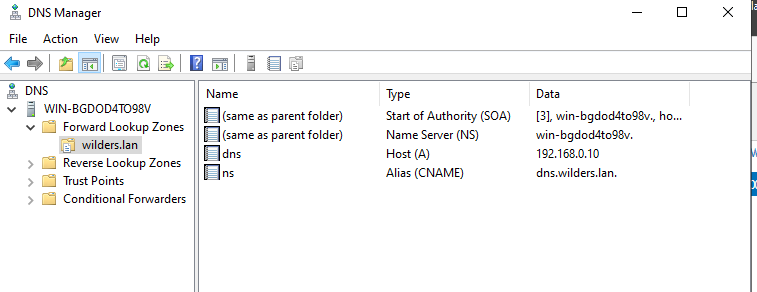

# Configuration d'un serveur DNS sur Windows Server

-   Dans le server manager  faire Add roles and features puis Sélectionner DNS Server et faire l'installation
    
-   Ouvrir depuis Tools > DNS
    
-   Créer une Forward Lookup Zone : cliquer sur Forward Lookup Zones puis New Zone. Choisir Primary Zone et Nom : `wilders.lan`
    
-   Ajouter un A record dans `wilders.lan` pour `dns.wilders.lan` dirigeant vers `192.168.0.10`
    
-   Ajouter un CNAME record pour `dnsalias.wilders.lan` dirigeant vers `dns.wilders.lan`

  
    
-   Créer une Reverse Lookup Zone en cliquant droit sur Reverse Lookup Zones puis New Zone. Choisir Primary Zone et Nom : `0.168.192.in-addr.arpa` pour le réseau `192.168.0.0/24`
    
-   Ajouter un PTR record dans la zone reverse pour `192.168.0.10` dirigeant vers `dns.wilders.lan`
    
-   Faire les vérifications avec la commande `nslookup` pour `dns.wilders.lan` et `nslookup 192.168.0.10`.
